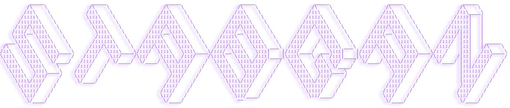

<!--- Moving text -->

  

<!--- stats -->

   •  
  <!--  •    -->
  <!--  • -->
   •
   •

<!--- Quote -->

|  | 
<a href="https://stabgan.bio.link" target="_blank"> Social Links</a>
 |
|---|---|

<h2 align="center" style="font-family: 'Poppins', sans-serif; font-weight: bold;">Main Skills</h2>

  

    
    
    
    
    
    
    
  

<a href="https://stabgan.com" target="_blank"  >
    <picture>
  <source media="(prefers-color-scheme: dark)" srcset="https://raw.githubusercontent.com/stabgan/stabgan/output/github-contribution-grid-snake-dark.svg" />
  <source media="(prefers-color-scheme: light)" srcset="https://raw.githubusercontent.com/stabgan/stabgan/output/github-contribution-grid-snake.svg" />
  
</picture>

#

<!--- stats & Trophy (start) -->
<h2 align="center" style="font-family: 'Poppins', sans-serif; font-weight: bold;">GitHub Trophies</h2>
 

  

#

<h2 align="center" style="font-family: 'Poppins', sans-serif; font-weight: bold;">GitHub Stats</h2>
 

<a href= "https://stabgan.com" align="center">
<table width="100%">
  <tr>
    <td align="center" width="50%">
      
    </td>
    <td align="center" width="50%">
      
    </td>
  </tr>
</table>
</a>

#

<table style="width:100%">
  <tr>
    <td style="width:30%; padding:10px;">
      
    </td>
    <td style="width:70%; padding:10px;">
      
    </td>
  </tr>
</table>

